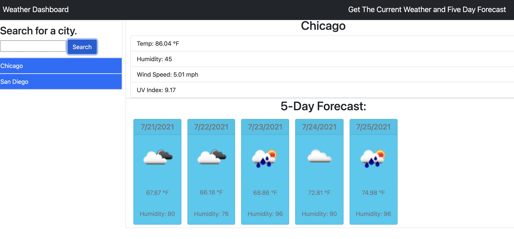
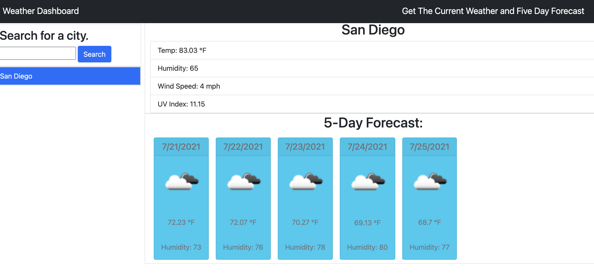

# Weather Dashboard
  

  ## Description

  The application is a weather dashboard that allows users to search for weather in a given city. The user will be met with the city's current weather, UV index, and five day forecast. The user's search history will be saved on the page.

  The application utilizes the [OpenWeather API](https://openweathermap.org/api) to retrieve the weather data and stores data using the localStorage property. 

  ## Table of Contents

  * [Usage](#usage)

  * [Badges](#badges)

  * [Questions](#questions)

  ## Usage

  GitHub Repository: 

  [Github Repository](https://github.com/cikennedy/weather-dashboard)

  GitHub Pages Link: 

  [Deployed Application](https://cikennedy.github.io/weather-dashboard/)

  
  

  ## License

  This project is licensed using the MIT license.

  ## Badges

  

  ## Questions

  If you have any questions or feedback about the project, please contact me by email at [kennedy.christopherian@gmail.com](mailto:kennedy.christopherian@gmail.com). 

  Other projects and work are featured at [cikennedy](https://github.com/cikennedy).

